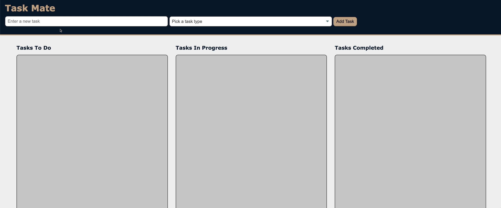
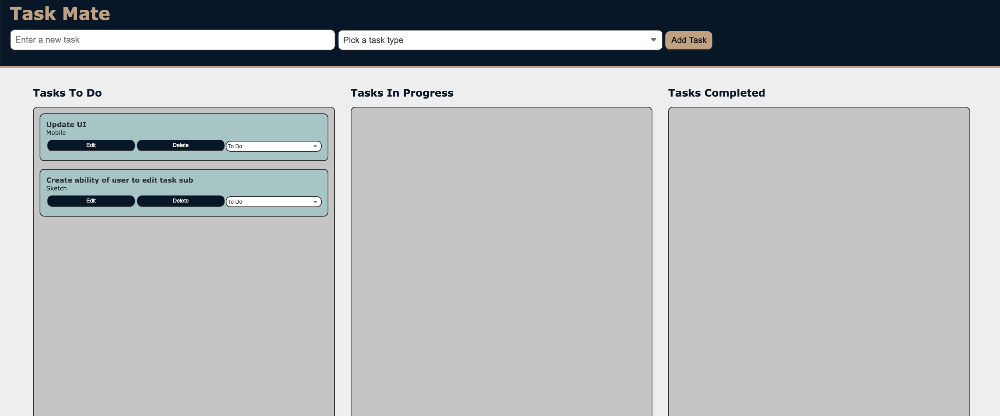
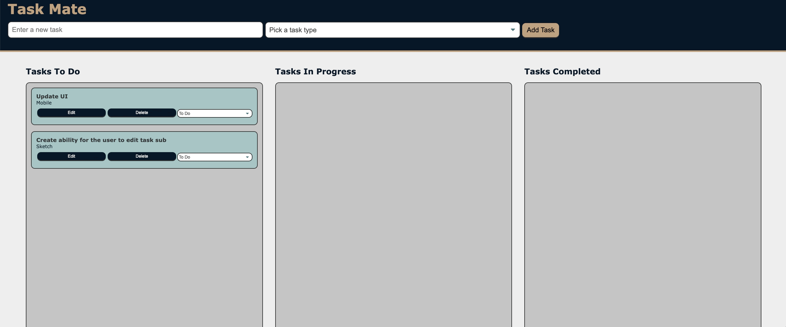
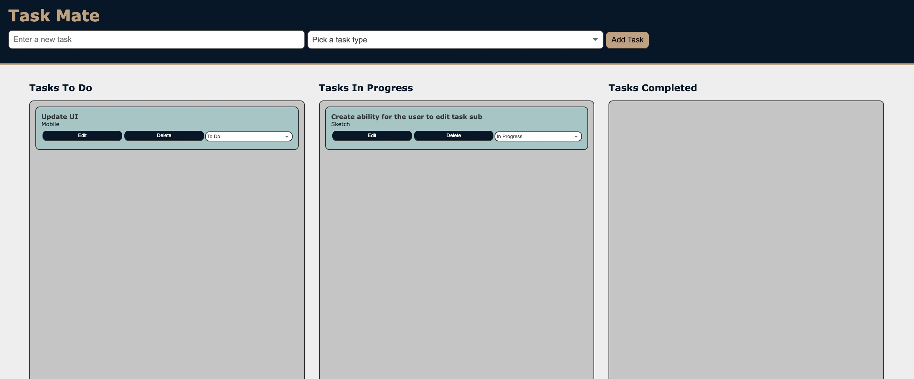

# task_mate

## Description

Simple task manager while on the go! Quickly save, edit and delete tasks.

[**Taskmate**](http://taskmate.io/)

## Table of Contents

- [Usage](#usage)
- [License](#license)
- [Questions](#questions)

## Usage

**Add tasks and choose a sub topic!**

**Made a type-o? Edit the task name**

**Move the task along the board as you progress**

**Finally delete the task**

Best of all, its always saved on your device so you can access it on the go!

## License

MIT License

Copyright (c) 2023 DiSantoz

Permission is hereby granted, free of charge, to any person obtaining a copy
of this software and associated documentation files (the "Software"), to deal
in the Software without restriction, including without limitation the rights
to use, copy, modify, merge, publish, distribute, sublicense, and/or sell
copies of the Software, and to permit persons to whom the Software is
furnished to do so, subject to the following conditions:

The above copyright notice and this permission notice shall be included in all
copies or substantial portions of the Software.

THE SOFTWARE IS PROVIDED "AS IS", WITHOUT WARRANTY OF ANY KIND, EXPRESS OR
IMPLIED, INCLUDING BUT NOT LIMITED TO THE WARRANTIES OF MERCHANTABILITY,
FITNESS FOR A PARTICULAR PURPOSE AND NONINFRINGEMENT. IN NO EVENT SHALL THE
AUTHORS OR COPYRIGHT HOLDERS BE LIABLE FOR ANY CLAIM, DAMAGES OR OTHER
LIABILITY, WHETHER IN AN ACTION OF CONTRACT, TORT OR OTHERWISE, ARISING FROM,
OUT OF OR IN CONNECTION WITH THE SOFTWARE OR THE USE OR OTHER DEALINGS IN THE
SOFTWARE.

## Questions

Hi my name is [DiSantoz](https://github.com/DiSantoz) the developer behind taskMate !

If you have any questions about the usage of this project or any suggestions on how to better this project please feel free to contact me!
